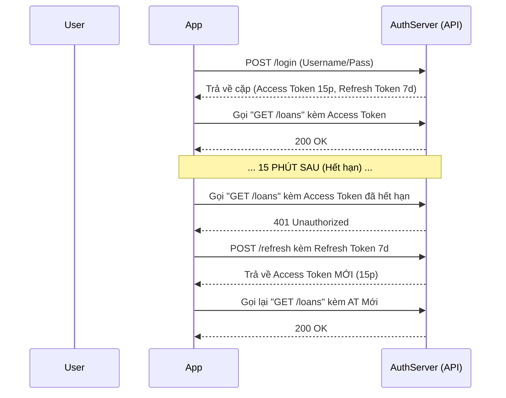

# 2. Các thuật ngữ Nâng cao và Lỗ hổng bảo mật tiêu biểu

Một file JWT cơ bản dễ cài đặt nhưng lại đi kèm những thiết kế đánh đổi cực lớn. Bài này phân tích rủi ro và các công cụ giúp khóa chặt bảo mật: Refresh Token, Roles và Scopes.

---

## 2.1 Refresh Token và "Bài toán tuổi thọ"

### Nỗi đau của JWT là gì?
JWT tự chứa (Self-contained). Server tin hoàn toàn vào Chữ ký (Signature). Nhưng điều đó dẫn đến một sự thật hiển nhiên: **Nếu không sửa Database, bạn không thể ép một JWT hết hạn trước thời gian (Revoke) theo chuẩn**. Bạn logout ở máy A, nhưng copy chuỗi JWT đó sang máy B, máy B vẫn đăng nhập được!

### Giải pháp: Phân đôi quyền lực

Để giảm rủi ro Leakage, ta tách quyền thành 2 token:
1. **Access Token (Thẻ ra vào):**
   - Vòng đời: Rất cực ngắn (vd: 15 phút, 1 giờ).
   - Được gắn vào mỗi HTTP header API Request.
   - Lộ cũng ít thiệt hại, vì lát sau nó tự phế.
2. **Refresh Token (Thẻ gia hạn):**
   - Vòng đời: Dài (vd: 7 ngày, 30 ngày).
   - Chỉ dùng duy nhất để đem đến endpoint `/auth/refresh` và lấy cái Access Token mới.
   - **Nó có thể bị Server xóa (Revoke) thẳng trong DB nếu nghi ngờ rủi ro** (đây là lúc hệ thống chịu hy sinh chút hiệu năng để gọi DB).

---

## 2.2 Roles vs Scopes trong thiết kế

Trong phân quyền nghiệp vụ Thư viện, ta nghe rất nhiều về Roles và Scopes.

* **Roles (Vai trò):** Những gì User NÀY LÀ. 
  * Ví dụ: Anh Tâm là `admin`, Chị Oanh là `member`. Cột `role` lưu trong DB. Nếu Backend thấy `role = admin` thì cho phép "Sửa thông tin sách".
* **Scopes (Phạm vi):** Những gì Ứng dụng/Token NÀY ĐƯỢC PHÉP LÀM.
  * Tách biệt với người dùng. Cùng một user Oanh (`member`), xin token bằng Web App sẽ có full scope (`read+write` loans). Nhưng xin bằng chiếc Apple Watch, token cấp ra chỉ có scope=`read` (chỉ cho xem hạn, không được ấn mượn). 

> [!TIP]
> Trong FASTAPI của tuần này, ta có thể nhúng Scopes vào trực tiếp `Security()` dependency. Đây là cách làm Authentication vô cùng tinh tế và mạnh mẽ.

---

## 2.3 Token Leakage & Replay Attack (Mối đe dọa)

### Token Leakage (Lộ thông tin Token)
**Nguyên nhân chính:** Thói quen lưu `localStorage` ở Front-end. `localStorage` dễ bị lấy cắp bởi lỗi dính mã độc XSS (nếu hacker tiêm được thẻ `<script>` vào web bạn, hắn sẽ `console.log(localStorage.getItem('token'))`).
**Khắc phục:** Lưu dưới dạng `HttpOnly Cookie`. Trình duyệt tự gán tự gởi, JavaScript bị "câm", tuyệt đối không đụng vào được.

### Replay Attack (Tấn công Cựu chiến thuật)
Kẻ thù chộp được gói tin (hoặc chộp được Token chưa hết hạn), sau đó "phát lại" (Playback / Replay) đoạn request đó lên máy chủ. API thấy token hợp lệ, nên cho qua.
**Ví dụ trong demo:** Kẻ cướp lấy được Token của Tuấn (`member`) và gọi API mượn hàng chục cuốn sách quý.
**Khắc phục cơ bản:** Luôn dùng Refresh Token kết hợp Access token ngắn, Check Fingerprint / JTI, Audit IP (có thể dùng trong server).

👉 Hãy chạy thử code ở thư mục `week_6` để thấy rõ.
